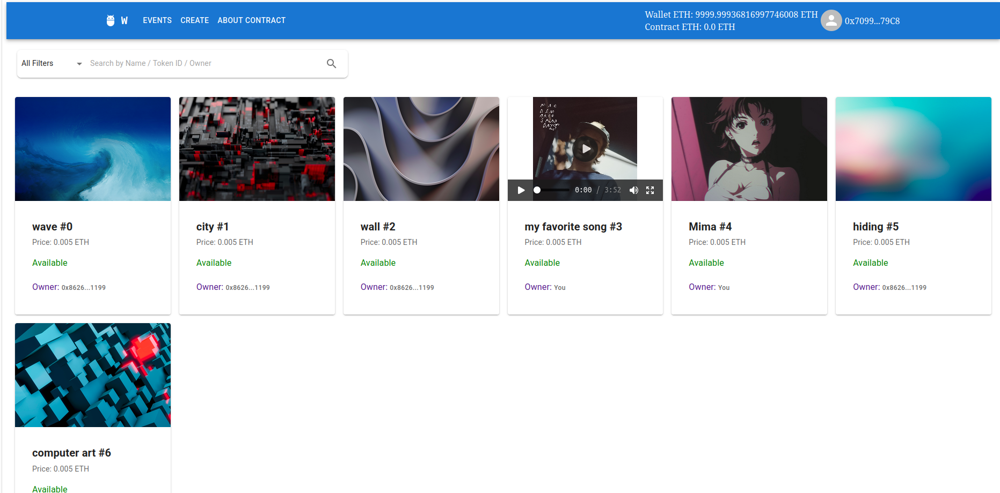
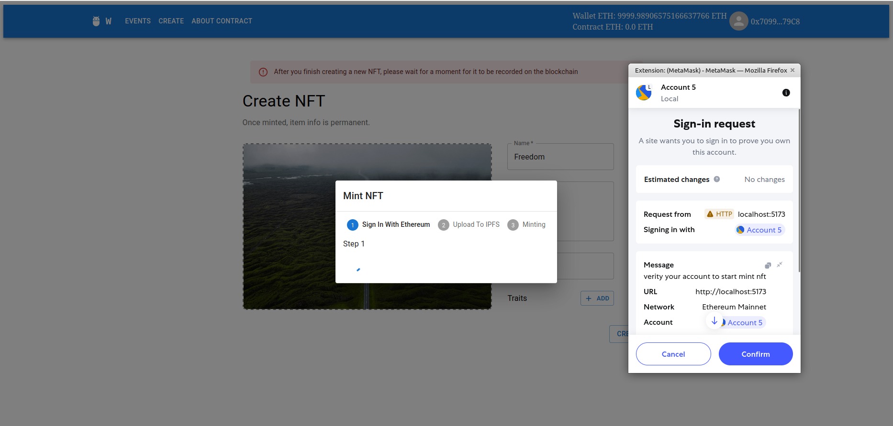

# ⛓️‍💥 NFT Marketplace 



[🫸View More Images🫷 ](./images/)
# 📋 Tech Stack
- 🧩 Frontend: React + vite
- 🧩 Smart Contract: Solidity + Hardhat
- 🧩 Backend: Typescript + Express
- 🧩 IPFS/ storage: Pinata (pining service)
- 🧩 Test: Slither

# Hướng dẫn Chạy Demo
Hướng dẫn này giúp bạn chạy thử dự án demo một cách nhanh chóng.

## Yêu cầu Cài đặt

Đảm bảo bạn đã cài đặt các phần mềm sau:

1.  **Node.js (LTS mới nhất):** Môi trường chạy JavaScript. Tải tại [nodejs.org](https://nodejs.org/).
    * Kiểm tra cài đặt bằng Terminal:
        ```bash
        node -v
        npm -v
        ```
2.  **MetaMask Extension:** Ví điện tử cho trình duyệt để tương tác với DApp. Cài đặt tại [metamask.io](https://metamask.io/).

## Các Bước Chạy Demo trên local

Thực hiện theo các bước sau để chạy demo:

### 1. Khởi chạy Blockchain Cục bộ (Local Node)

1.  **Cài đặt thư viện dự án:**
    * Mở Terminal, di chuyển đến thư mục gốc của dự án.
    * Chạy lệnh:
        ```bash
        npm install
        ```
2.  **Biên dịch Smart Contract:**
    * Tại thư mục gốc, chạy:
        ```bash
        npx hardhat compile
        ``` 
3.  **Tạo mã typescript từ ABI của smart contract:**
    * ```bash
        npm run typechain
        ```
3.  **Khởi động Local Node:**
    * Tại thư mục gốc, chạy:
        ```bash
        npx hardhat node
        ```
    * Terminal này sẽ hiển thị các tài khoản thử nghiệm và khóa riêng tư (Private Key). **Giữ Terminal này luôn mở**.
4.  **Kết nối MetaMask với Local Node:**
    * Mở MetaMask.
    * **Thêm mạng Hardhat Localhost:**
        * Chọn "Add network".
        * Chọn "Add a network manually" (nếu có).
        * Nhập thông tin sau:
            * **Network Name:** `Hardhat Localhost`
            * **New RPC URL:** `http://127.0.0.1:8545`
            * **Chain ID:** `31337`
            * **Currency Symbol:** `ETH` (tùy chọn)
        * Nhấn "Save".
    * **Import tài khoản thử nghiệm:**
        * Đảm bảo bạn đang ở mạng "Hardhat Localhost".
        * Nhấp vào biểu tượng tài khoản, chọn "Import account".
        * Copy một **Private Key** từ Terminal đang chạy `npx hardhat node` và dán vào MetaMask. Nhấn "Import".
        * **Lưu ý:** Không dùng các khóa này cho tài sản thật.
5.  **Triển khai Smart Contract:**
    * Mở một **Terminal mới**.
    * Di chuyển đến thư mục gốc.
    * Chạy lệnh:
        ```bash
        npx hardhat ignition deploy ./ignition/modules/Whisky.ts --network localhost
        ```

### 2. Khởi chạy Express Pinata Server

1.  **Cài đặt thư viện server:**
    * Mở Terminal, di chuyển đến thư mục `express-pinata-server`.
    * Chạy lệnh:
        ```bash
        npm install
        ```
2.  Đăng ký dịch vụ Pinata tại [Pinata](https://pinata.cloud/).
3.  Tạo file `.env` trong thư mục `express-pinata-server` với nội dung:
    ```
    PINATA_JWT=YOUR_PINATA_JWT
    GATEWAY_URL=YOUR_PINATA_GATEWAY_URL
    ```
    Thay `YOUR_PINATA_JWT` và `YOUR_PINATA_GATEWAY_URL` bằng API Key và Gateway URL từ Pinata.
4.  **Chạy server:**
    ```bash
    npm run dev
    ```

### 3. Khởi chạy Giao diện Người dùng (Frontend)

1.  **Cài đặt thư viện Frontend:**
    * Mở Terminal, di chuyển đến thư mục `dapp`.
    * Chạy lệnh:
        ```bash
        npm install
        ```
2.  Tạo file `.env.local` trong thư mục `dapp` với nội dung:
    ```
    VITE_SERVER_URL=YOUR_EXPRESS_SERVER_URL
    VITE_GATEWAY_URL=YOUR_PINATA_GATEWAY_URL
    ```
    Thay `YOUR_EXPRESS_SERVER_URL` bằng URL của server Express Pinata (ví dụ: `http://localhost:8787`) và `YOUR_PINATA_GATEWAY_URL` bằng Gateway URL của Pinata.
3.  **Khởi chạy ứng dụng Frontend:**
    * Trong Terminal tại thư mục `dapp`, chạy:
        ```bash
        npm run dev
        ```
    * Mở trình duyệt tại địa chỉ hiển thị trong Terminal (ví dụ: `http://localhost:3000` hoặc `http://localhost:5173`).
    * Kết nối MetaMask và chọn tài khoản đã import để tương tác với ứng dụng.

## Test Smart Contract bằng công cụ `slither`
Ở thư mục gốc chạy các lệnh sau để cài đặt
```bash
python3 -m venv .venv
source ./.venv/bin/activate 
pip3 install -r requirements.txt
```
Kiểm tra
```bash
slither .
```
